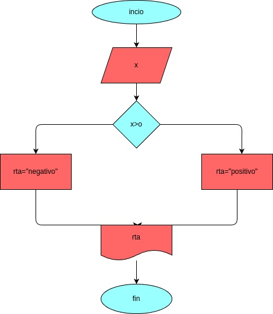

# numero_positivo
programa para calcular si un numero es positivo

# Analisis

### variable de entrada
- x: digite un numero 

### procedimiento
if (X>0): 
    rta = "positivo"
else:
    rta = "negativo o cero"

## Diseño

