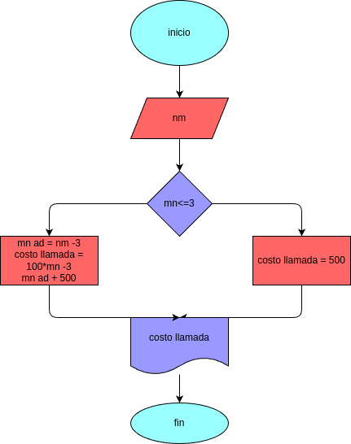

# tiempo_llamada
programa para calcular el costo de la llamada

## Analisis

### Variable de entrada
-min = digite la duracion de la llamada

### procedimiento
if (min <= 3): 
    costo_llamada = 500
else:
    rta = costo_llamada = 500 + (min - 3)*100

## Diseño

