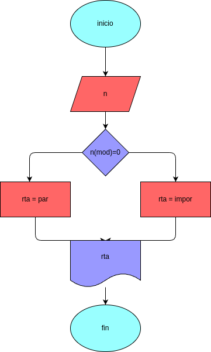

# numero_entero
programa para saver si un numero es entero

## Analisis

### Variable de entrada
-x = digite el numero

### procedimiento
mod = X%2
if (mod == 0):
    rta = "par"
else:
    rta = "impar"

## Diseño

