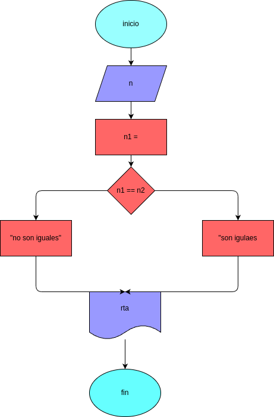

# dos_ultimos_digitos
programa para verificar si los dos ultimos digitos son iguales

## Analisis

### Variable de entrada
-x = digite el numero

### procedimiento
ultimo_digito = X % 10
penultimo_digito = (X//10)%10
if (ultimo_digito == penultimo_digito):
    rta = "igual"
else:
    rta = "diferentes"

## Diseño

