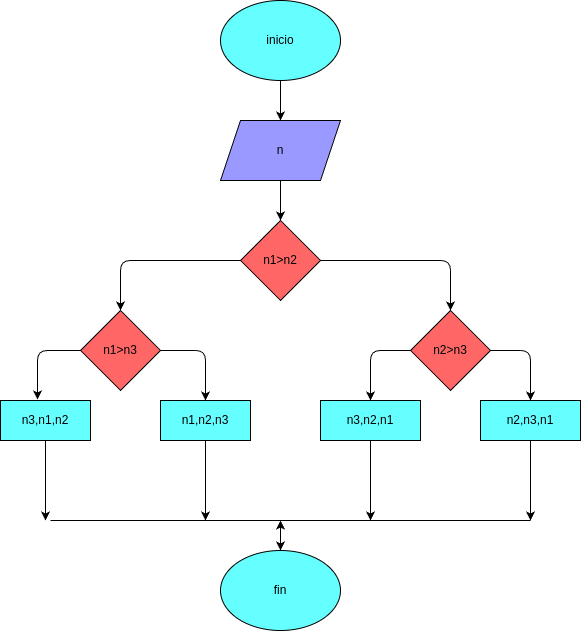

# 3_numeros_determinar
programa para saver entre tres numeros cual es el mayor

## Analisis

### Variable de entrada
A=int(input("digite el valor de A: "))
B=int(input("digite el valor de B: "))
C=int(input("digite el valor de C: "))

### procedimiento
if(A>C):
    if(A>C):
        rta=A
    else:
        rta=C
else:
    if(B>C):
        rta=B
    else:
        rta=C

## Diseño

